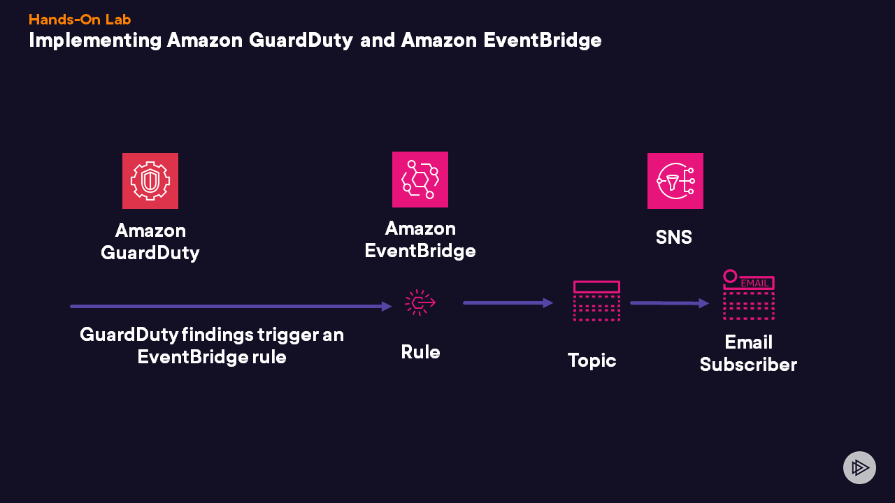

# Implementing Amazon GuardDuty and Amazon EventBridge
## Introduction
Globomantics is a global healthcare organization who have recently moved their key systems to AWS. Recently, they have become concerned about how difficult it is to manually keep track of security threats and best practices. You have been tasked to implement a solution that will:

• Automatically monitor for security threats targeted against their AWS accounts and deployed resources • Provide notification when security threats are seen

Having considered several options, you have decided to recommend that Globomantics implement Amazon GuardDuty.

In this lab, you will:


## Create an SNS topic with an email subscriber.
Enable Amazon GuardDuty.
Create an Amazon EventBridge rule with the SNS topic as the target.
Solution
Log in to the AWS Management Console using the credentials provided on the lab instructions page. Make sure you're using the us-east-1 Region.

Create an SNS Topic
Under Recently Visited, select Simple Notification Service. If you do not see that service listed, then enter sns in the search bar on top of the console and select Simple Notification Service from the search results.
Under Topic name, enter a name for your new SNS topic, such as emailME.
Click the Next step button.
On the Create topic page, under Display name - optional, enter My Email Topic.
Select Access policy - optional to expand this section.
Under Publishers, select Everyone from the dropdown menu.
Under Subscribers, select Everyone from the dropdown menu.
Click the Create topic button.
Create an Email Subscriber
In the lefthand navigation menu, select Subscriptions.
Click the Create subscription button.
On the Create subscription page, click the field under Topic ARN and select the existing SNS topic from the dropdown menu.
Under Protocol, select Email from the dropdown menu.
Under Endpoint, enter a valid email address with an inbox that you can access.
Click the Create subscription button.
Log in to the email address that you entered and check the inbox for the notification email. Please note, sometimes it can take 15 minutes or so for the email to reach your inbox.
When you receive the email, select Confirm subscription to subscribe to the SNS topic.
Return to the AWS Management Console and refresh the page. Under Status, the status should display as Confirmed.
Create an Amazon EventBridge Rule
In the search bar on top of the console, enter eventbridge.
From the search results, select Amazon EventBridge.
Under Get started, select EventBridge Rule.
Click the Create rule button.
On the Define rule detail, set the following paramters:
Name: Enter GloboRule1.
Description - optional: Enter Globomantics Rules for Amazon GuardDuty Integration.
Event bus: Select default from the dropdown menu.
Click the Next button.
On the Build event pattern page, set the following parameters:
Event source: Ensure that AWS events or EventBridge partner events is selected.
Creation method: Ensure that Use pattern form is selected.
Event source: Select AWS services from the dropdown menu.
AWS service: Select GuardDuty from the dropdown menu.
Event type: Select GuardDuty Finding from the dropdown menu.
Click the Edit pattern button.

In the code block, replace the existing pattern with the pattern below:

```{
  "source": ["aws.guardduty"],
  "detail-type": ["GuardDuty Finding"],
  "detail": {
    "type": ["Policy:IAMUser/RootCredentialUsage"]
  }
}```
Click the Next button.

On the Select target(s) page, set the following parameters:

Select a target: Select SNS topic from the dropdown menu.
Topic: Select the SNS topic that you previously created.
Select Additional settings to expand this section.

Under Configure target input, select Input transformer from the dropdown menu.

Click the Configure input transformer button.

In the pop-up window that opens, under Input path, enter the following input path and variables:

```{"Account_ID":"$.detail.accountId",
"Finding_ID":"$.detail.id",
"Finding_Type":"$.detail.type",
"Finding_description":"$.detail.description",
"region":"$.region",
"severity":"$.detail.severity"}```
Under Template, enter the following email template:

```"AWS <Account_ID> has a new GuardDuty finding with a severity of <severity>. The GuardDuty finding type is <Finding_Type> and has been generated from the <region> Region."

"Finding Description:"
"<Finding_description>. "

"For more details, open the GuardDuty console at https://console.aws.amazon.com/guardduty/home?region=<region>#/findings?search=id=<Finding_ID>"```
Click the Confirm button.

Click the Next button.

Click the Next button.

Click the Create rule button. It may take a minute or two to create the new EventBridge rule.

Enable Amazon GuardDuty
In the search bar on top, enter guardduty.
From the search results, select GuardDuty.
Click the Get Started button.
Click the Enable GuardDuty button.
Generate Sample Findings
In the lefthand navigation menu, select Findings. You should see that you don't have any findings at this time.
In the lefthand navigation menu, select Settings.
On the Settings page, under Sample findings, click the Generate sample findings button.
In the lefthand navigation menu, select Findings again. On the Findings page, you should see that several findings have been generated.
Select the Severity column to sort the table of findings.
In the Low severity findings, find and select the [SAMPLE]Policy:IAMUser/RootCredentialUsage finding. A pane should appear on the right side showing more information about this particular finding.
View the Automated Email
Note: you may have to generate more sample findings and wait several minutes to receive the AWS notification message in your email.

Go to the inbox for the email address that you previously entered to receive notifications from the SNS topic.
Once you receive the email, open it to read information about the sample finding related to the IAM user policy.
At the top of the console, select the Services icon in the top left corner.
Under Recently visited, select Amazon EventBridge.
In the lefthand navigation menu, select Rules.
On the Rules page, select the rule we just created.
Select the Monitoring tab. You should see a number of charts about invocations and triggered rules, showing that the EventBridge rule triggered the sending of the email notification to your inbox.