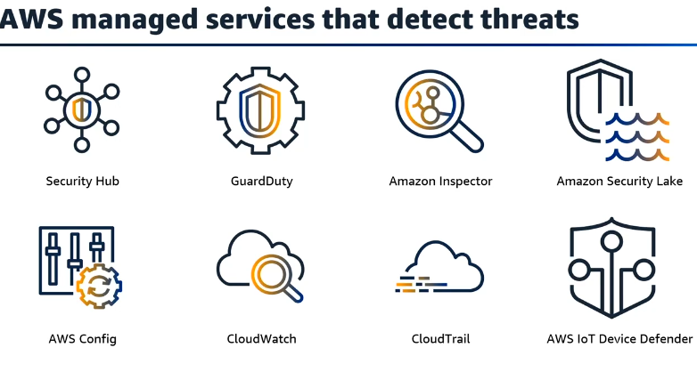

Below writeup is based on [Exam Prep Standard Course: AWS Certified Security - Specialty (SCS-C02 - English)](https://explore.skillbuilder.aws/learn/course/18291/Exam%2520Prep%2520Standard%2520Course%253A%2520AWS%2520Certified%2520Security%2520-%2520Specialty%2520%28SCS-C02%2520-%2520English%29)

# Domains

## Threat Detection and Incident Response

### Additional Resources
[AWS Security and Incident Response Guide](https://docs.aws.amazon.com/whitepapers/latest/aws-security-incident-response-guide/introduction.html)

[AWS Security Finding Format (ASFF)](https://docs.aws.amazon.com/securityhub/latest/userguide/securityhub-findings-format.html)

[Required attributes](https://docs.aws.amazon.com/securityhub/latest/userguide/asff-required-attributes.html)
[Playbooks](https://docs.aws.amazon.com/solutions/latest/automated-security-response-on-aws/playbooks-1.html)
[Creating your own runbooks](https://docs.aws.amazon.com/systems-manager/latest/userguide/automation-documents.html)
[Runbook](https://wa.aws.amazon.com/wellarchitected/2020-07-02T19-33-23/wat.concept.runbook.en.html)
[What is AWS Systems Manager Incident Manager? ](https://docs.aws.amazon.com/incident-manager/latest/userguide/what-is-incident-manager.html)
[Working with Systems Manager Automation runbooks in Incident Manager](https://docs.aws.amazon.com/incident-manager/latest/userguide/runbooks.html)
[How S3 Object Locks works](https://docs.aws.amazon.com/AmazonS3/latest/userguide/object-lock-overview.html)
[CAPTCHA and Challenge actions in AWS WAF](https://docs.aws.amazon.com/waf/latest/developerguide/waf-captcha-and-challenge.html)

## Security Logging and Monitoring

### Additional Resources
Review these materials to learn more about the topics covered in this exam domain:

[Using CloudWatch anomaly detection](https://docs.aws.amazon.com/AmazonCloudWatch/latest/monitoring/CloudWatch_Anomaly_Detection.html)
[AWS Security Incident Response Guide](https://docs.aws.amazon.com/whitepapers/latest/aws-security-incident-response-guide/introduction.html)
[Insights in AWS Security Hub](https://docs.aws.amazon.com/securityhub/latest/userguide/securityhub-insights.html)
[Logging IP traffic using VPC Flow Logs](https://docs.aws.amazon.com/vpc/latest/userguide/flow-logs.html)
[Flow log record examples](https://docs.aws.amazon.com/vpc/latest/userguide/flow-logs-records-examples.html)
[Troubleshooting access denied error messages](https://docs.aws.amazon.com/IAM/latest/UserGuide/troubleshoot_access-denied.html)
[Centralized Logging with OpenSearch](https://aws.amazon.com/solutions/implementations/centralized-logging-with-opensearch/)
[Using CloudTrail to identify unexpected behaviors in individual workloads](https://aws.amazon.com/blogs/security/using-cloudtrail-to-identify-unexpected-behaviors-in-individual-workloads/)

##  Infrastructure Security

### Additional Resources
[AWS Well-Architected Framework’s Security Pillar](https://docs.aws.amazon.com/wellarchitected/latest/security-pillar/design-principles.html)
[Monitoring with Amazon CloudWatch](https://docs.aws.amazon.com/waf/latest/developerguide/monitoring-cloudwatch.html) 
[AWS Best Practices for DDoS Resiliency](https://docs.aws.amazon.com/whitepapers/latest/aws-best-practices-ddos-resiliency/aws-best-practices-ddos-resiliency.html) 
[Website endpoints](https://docs.aws.amazon.com/AmazonS3/latest/userguide/WebsiteEndpoints.html)
[Restricting access to files on custom origins](https://docs.aws.amazon.com/AmazonCloudFront/latest/DeveloperGuide/private-content-overview.html#forward-custom-headers-restrict-access)
[Security perspective: compliance and assurance](https://docs.aws.amazon.com/whitepapers/latest/overview-aws-cloud-adoption-framework/security-perspective.html)
[MAC Security ](https://docs.aws.amazon.com/directconnect/latest/UserGuide/MACsec.html)
[Amazon Elastic Block Store (Amazon EBS)](https://docs.aws.amazon.com/AWSEC2/latest/UserGuide/AmazonEBS.html)
[AWS Systems Manager Patch Manager](https://docs.aws.amazon.com/systems-manager/latest/userguide/patch-manager.html)
[Understanding findings in Amazon Inspector](https://docs.aws.amazon.com/inspector/latest/user/findings-understanding.html)
[Amazon Inspector integration with AWS Security Hub](https://docs.aws.amazon.com/inspector/latest/user/securityhub-integration.html)
[What is Reachability Analyzer?](https://docs.aws.amazon.com/vpc/latest/reachability/what-is-reachability-analyzer.html)
[What is AWS Global Networks for Transit Gateways?](https://docs.aws.amazon.com/network-manager/latest/tgwnm/what-are-global-networks.html)
[Flow log record examples ](https://docs.aws.amazon.com/vpc/latest/userguide/flow-logs-records-examples.html)
[Centralized logging solution on AWS](https://aws.amazon.com/solutions/centralized-logging/?ref=wellarchitected)

## Identity and Access Management

### Additional Resources
[What is IAM?](https://docs.aws.amazon.com/IAM/latest/UserGuide/introduction.html)
[Security best practices in IAM](https://docs.aws.amazon.com/IAM/latest/UserGuide/best-practices.html)
[Managing IAM users](https://docs.aws.amazon.com/IAM/latest/UserGuide/id_users_manage.html)
[Example IAM identity-based policies](https://docs.aws.amazon.com/IAM/latest/UserGuide/access_policies_examples.html)
[IAM Access Analyzer](http://aws.amazon.com/iam/features/analyze-access/)
[Actions, resources, and condition keys for AWS services](https://docs.aws.amazon.com/service-authorization/latest/reference/reference_policies_actions-resources-contextkeys.html)
[Condition operators](https://docs.aws.amazon.com/IAM/latest/UserGuide/reference_policies_elements_condition_operators.html)
[Policy evaluation logic](https://docs.aws.amazon.com/IAM/latest/UserGuide/reference_policies_evaluation-logic.html)
[What is AWS CloudFormation Guard?](https://docs.aws.amazon.com/cfn-guard/latest/ug/what-is-guard.html)

## Data Protection

### Additional Resources
[Encrypting Data-at-Rest and Data-in-Transit](https://docs.aws.amazon.com/whitepapers/latest/logical-separation/encrypting-data-at-rest-and--in-transit.html)
[AWS Direct Connect + AWS Site-to-Site VPN](https://docs.aws.amazon.com/whitepapers/latest/aws-vpc-connectivity-options/aws-direct-connect-site-to-site-vpn.html)
[Hybrid connectivity VPN](https://docs.aws.amazon.com/whitepapers/latest/building-scalable-secure-multi-vpc-network-infrastructure/hybrid-connectivity.html)
[AWS Direct Connect ](https://docs.aws.amazon.com/whitepapers/latest/building-scalable-secure-multi-vpc-network-infrastructure/direct-connect.html)
[Building a global network using AWS Transit Gateway Inter-Region peering](https://aws.amazon.com/blogs/networking-and-content-delivery/building-a-global-network-using-aws-transit-gateway-inter-region-peering/)
[AWS Prescriptive Guidance Encryption best practices and features for AWS services](https://docs.aws.amazon.com/pdfs/prescriptive-guidance/latest/encryption-best-practices/encryption-best-practices.pdf)
[AWS Certificate Manager ](https://docs.aws.amazon.com/acm/latest/userguide/acm-overview.html)
[Amazon EC2 Instance Connect (EIC) Endpoint](https://aws.amazon.com/about-aws/whats-new/2023/06/amazon-ec2-instance-connect-ssh-rdp-public-ip-address/)
[Secure Connectivity from Public to Private: Introducing EC2 Instance Connect Endpoint](https://aws.amazon.com/blogs/compute/secure-connectivity-from-public-to-private-introducing-ec2-instance-connect-endpoint-june-13-2023/)
[Manage your storage lifecycle](https://docs.aws.amazon.com/AmazonS3/latest/userguide/object-lifecycle-mgmt.html)
[Managing backups using backup plans](https://docs.aws.amazon.com/aws-backup/latest/devguide/about-backup-plans.html)
[AWS KMS concepts](https://docs.aws.amazon.com/kms/latest/developerguide/concepts.html)
[Asymmetric keys in AWS KMS](https://docs.aws.amazon.com/kms/latest/developerguide/symmetric-asymmetric.html)
[Grants is AWS KMS](https://docs.aws.amazon.com/kms/latest/developerguide/grants.html)
[What is AWS Nitro Enclaves?](https://docs.aws.amazon.com/enclaves/latest/user/nitro-enclave.html)

## Management and Security Governance

### Additional Resources
[Governance](https://docs.aws.amazon.com/wellarchitected/latest/security-pillar/governance.html)
[Security](https://docs.aws.amazon.com/wellarchitected/latest/framework/security.html)
[Learn template basics](https://docs.aws.amazon.com/AWSCloudFormation/latest/UserGuide/gettingstarted.templatebasics.html)
[Working with AWS Firewall Manager policies](https://docs.aws.amazon.com/waf/latest/developerguide/working-with-policies.html)
[Getting started with an AWS CloudFormation product](https://docs.aws.amazon.com/servicecatalog/latest/adminguide/getstarted-CFN.html)
[AWS Config and AWS Organizations](https://docs.aws.amazon.com/organizations/latest/userguide/services-that-can-integrate-config.html)
[AWS Audit Manager evidence](https://docs.aws.amazon.com/audit-manager/latest/userguide/evidence-finder.html#understanding-evidence-finder)
[Mitigation techniques](https://docs.aws.amazon.com/whitepapers/latest/aws-best-practices-ddos-resiliency/mitigation-techniques.html)
[Using CloudWatch anomaly detection](https://docs.aws.amazon.com/AmazonCloudWatch/latest/monitoring/CloudWatch_Anomaly_Detection.html)
[Guidance for baseline security assessment on AWS](https://aws.amazon.com/solutions/guidance/baseline-security-assessment-on-aws/#:~:text=Use%20the%20provided%20AWS%20CloudFormation,how%20to%20resolve%20the%20issues.)

--------------------------------------------------------------------------------------------------------------------------------------------------------------------------

# Cheatsheets vs syllabus
AWS services and features 
Note: Security affects all AWS services. Many services do not appear in this list because the overall service is 
out of scope, but the security aspects of the service are in scope. For example, a candidate for this exam would 
not be asked about the steps to set up replication for an S3 bucket, but the candidate might be asked about 
configuring an S3 bucket policy. 

## Management and Governance: 
• [AWS Audit Manager](https://tutorialsdojo.com/aws-audit-manager/) 
• [AWS CloudTrail](https://tutorialsdojo.com/aws-cloudtrail/) 
        labs:
        [Triggering Events with CloudTrail Logs](https://learn.acloud.guru/handson/c80bd323-11ca-49a6-9028-96752e8f21fd)
        [Monitoring, Auditing, and Logging Users and Resource Usage in AWS IAM](https://learn.acloud.guru/handson/9c173560-f318-4a3a-97fa-341bdbdc76a3)
        [Using AWS Config and CloudTrail](https://learn.acloud.guru/handson/8a520336-4709-4e12-8636-0d68e2e00273)
• [Amazon CloudWatch](https://tutorialsdojo.com/amazon-cloudwatch/) 
    [CloudTrail vs CloudWatch](https://tutorialsdojo.com/aws-cloudtrail-vs-amazon-cloudwatch/)
• [AWS Config](https://tutorialsdojo.com/aws-config/) 
        labs:
        [Setting up Automatic Resource Remediation with AWS Config](https://learn.acloud.guru/handson/bd0330c4-ec18-46b5-b673-3f02eb7cd15c)
        [Auditing Resource Compliance with AWS Config](https://learn.acloud.guru/handson/b0e842b6-2254-4a4e-be50-14e01bf8233b)
• [AWS Organizations ](https://tutorialsdojo.com/aws-organizations/)
• [AWS Systems Manager](https://tutorialsdojo.com/aws-systems-manager/) 
        labs:
        [Creating an IAM Role and Configuring an EC2 Instance for AWS Systems Manager via the AWS Management Console](https://learn.acloud.guru/handson/41fa20fe-7199-4a0a-a02c-e86fb26613c8)
• [AWS Trusted Advisor](https://tutorialsdojo.com/aws-trusted-advisor/)

## Networking and Content Delivery: 
• [Amazon Detective](https://tutorialsdojo.com/amazon-detective/)
        labs:
        [Detecting Security Issues Using GuardDuty](https://learn.acloud.guru/handson/f3a6e65f-261a-4337-816f-5875ed4dd3e7)
        [Adding Dialog to an Alexa Skill](https://learn.acloud.guru/handson/09927777-f170-4502-8c4d-69d3a244a651) 
• [AWS Firewall Manager](https://tutorialsdojo.com/aws-firewall-manager/)
        labs:
        [Creating and Configuring a WAF](https://learn.acloud.guru/handson/02832161-9dfc-4c5c-8a1b-dd290dbc0050)
        [Configuring Centralized Access to the Internet](https://learn.acloud.guru/handson/a0663149-5b0a-4f83-90c8-056f42acb58f)  
        [Securing an Application with Multiple AWS Services](https://learn.acloud.guru/handson/fb220576-483e-4b0b-809d-3c02c62e4223)  
• [AWS Network Firewall](https://tutorialsdojo.com/aws-network-firewall/)
        labs:
        [Configuring an AWS Network Firewall](https://learn.acloud.guru/handson/06ea5cd8-8eb8-4e3a-a679-715f820ee637)
        [Implementing AWS Network Firewall](https://learn.acloud.guru/handson/76117bc4-bdb2-4ff6-bc89-551076a52e4f7) 
• [AWS Security Hub](https://tutorialsdojo.com/aws-security-hub/) 
        labs:
        [Using AWS Security Hub to Analyze an AWS Account](https://learn.acloud.guru/handson/c084edc8-8e1f-4dfe-9c89-237a229f61d0) --> attempted 16th June
        [Automating Findings Identified by AWS Security Hub](https://learn.acloud.guru/handson/5b20ca8a-f5d0-479a-8519-719d8d89eddd) 
        [Identifying and Remediating Threats with AWS Security Hub](https://learn.acloud.guru/handson/572af34e-00c4-45a4-9a68-4a2e8f0c79d6)
        [Implementing AWS Security Hub](https://learn.acloud.guru/handson/0f3e45ce-4103-4c1e-89c6-20e9247383fd) 
        [Proactive Security with AWS Security Hub](https://learn.acloud.guru/handson/1072865a-7d87-4ba6-9a6f-d67465b5dd0f)
        [Configuring Amazon Inspector with Systems Manager to Assess Application Compliance](https://learn.acloud.guru/handson/609a2394-0815-487e-bb8a-b8f8155c6d4f) 
• [AWS Shield](https://tutorialsdojo.com/aws-shield/) 
• [Amazon VPC](https://tutorialsdojo.com/amazon-vpc/) 
    o [VPC endpoints](https://tutorialsdojo.com/vpc-interface-endpoint-vs-gateway-endpoint-in-aws/) 
            labs:
            [Create a VPC Endpoint and S3 Bucket in AWS](https://learn.acloud.guru/handson/37331c72-e3f1-4ded-9607-61d993fbb5a5)
            [AWS VPC Endpoints for S3](https://learn.acloud.guru/handson/9256ae5b-e266-40a5-8f6c-5610aae4bac1) 
    o Network ACLs 
            labs:
            [Configuring a Basic VPC in AWS](https://learn.acloud.guru/handson/c30ef1d8-6dff-434d-a484-698027c13d53)
            [Troubleshooting AWS Network Connectivity: Security Groups and NACLs](https://learn.acloud.guru/handson/cffb7f13-1c46-45cb-886a-f0bb12ff038c) 
    o Security groups 
    o Network Access Analyzer 
• [AWS WAF](https://tutorialsdojo.com/aws-waf/)
extras: [IP Blocking: Use AWS WAF or NACL?](https://tutorialsdojo.com/ip-blocking-use-aws-waf-or-nacl/)

## Security, Identity, and Compliance: 
• [AWS Certificate Manager (ACM)](https://tutorialsdojo.com/aws-certificate-manager/) 
        labs:
        [Configuring a Custom Domain with Cognito](https://learn.acloud.guru/handson/0b77909a-2844-461f-b865-60229e614ad4)
• [AWS CloudHSM ](https://tutorialsdojo.com/aws-cloudhsm/)
• [AWS Directory Service ](https://tutorialsdojo.com/aws-directory-service/)
• [Amazon GuardDuty]()
        labs:
        [Implementing Amazon GuardDuty and Amazon EventBridge](https://learn.acloud.guru/handson/ec10e337-901c-4524-9d3c-d78eefd921e7)
        [Detecting Security Issues Using GuardDuty](https://learn.acloud.guru/handson/f3a6e65f-261a-4337-816f-5875ed4dd3e7)

• [AWS Identity and Access Management (IAM)](https://tutorialsdojo.com/aws-identity-and-access-management-iam/) 
• [Amazon Inspector](https://tutorialsdojo.com/amazon-inspector/) 
• [AWS Key Management Service (AWS KMS) ](https://tutorialsdojo.com/aws-key-management-service-aws-kms/)
        labs:
        [AWS Security Essentials - KMS Integration with S3](https://learn.acloud.guru/handson/e4e6a251-06af-4046-992b-84f0ece1d3fb)
• [Amazon Macie](https://tutorialsdojo.com/amazon-macie/) 
• AWS Single Sign-On